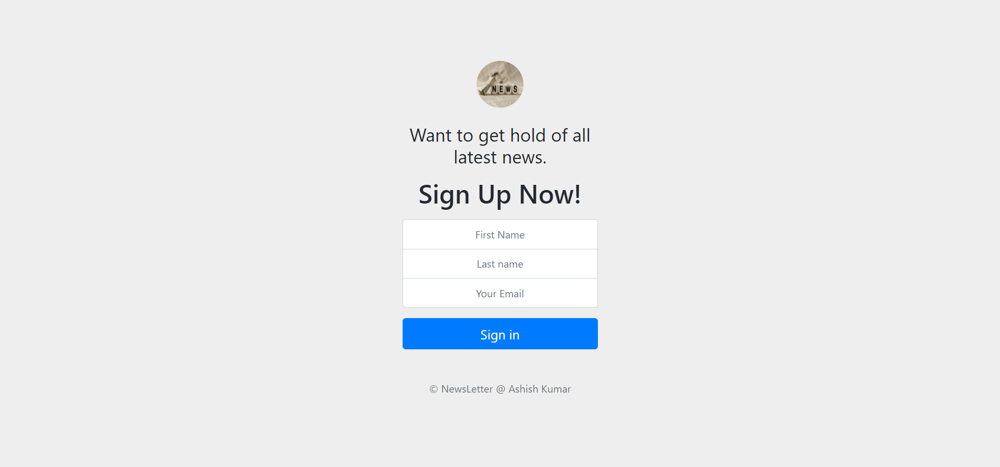
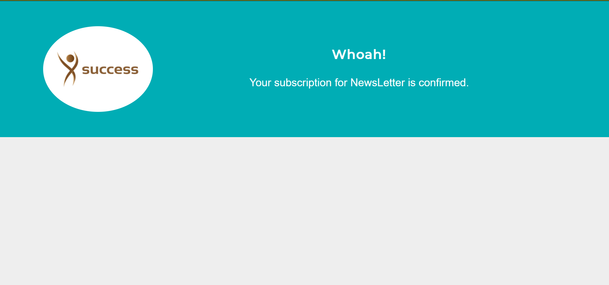

<h1 align="center">
  <br>
  <a href="https://github.com/ksenior-2608/newsletter"></a>
  <br>
  Newsletter
  <br>
</h1>

<h4 align="center">An Exclusive Web Application to activate newsletter subscription. </h4>

<p align="center">
  <a href="#grabs">Screen Grabs</a> •
  <a href="#key-features">Key Features</a> •
  <a href="#how-to-use">How To Use</a> •
  <a href="#credits">Credits</a> 
</p>

## Screen Grabs
  * Sign Up Page

    
  * Subscription request sucess page

    
  *

## Key Features

  * Simple sign up page
    - Takes user credential and uses Mailchimp API to activate subscription. 
    

## How To Use

To clone and run this application, you'll need [Git](https://git-scm.com) and [Node.js](https://nodejs.org/en/download/) (which comes with [npm](http://npmjs.com)) installed on your computer. From your command line:

```bash
# Clone this repository
$ git clone https://github.com/ksenior-2608/newsletter.git

# Go into the repository
$ cd event-journal

# Install dependencies
$ npm install

# Run the app
$ npm start
```

## Credits

This software uses the following open source packages:

- [Node.js](https://nodejs.org/)
- [Express - Node.js web application framework](https://expressjs.com/)


---

> GitHub [@ksenior-2608](https://github.com/ksenior-2608)

